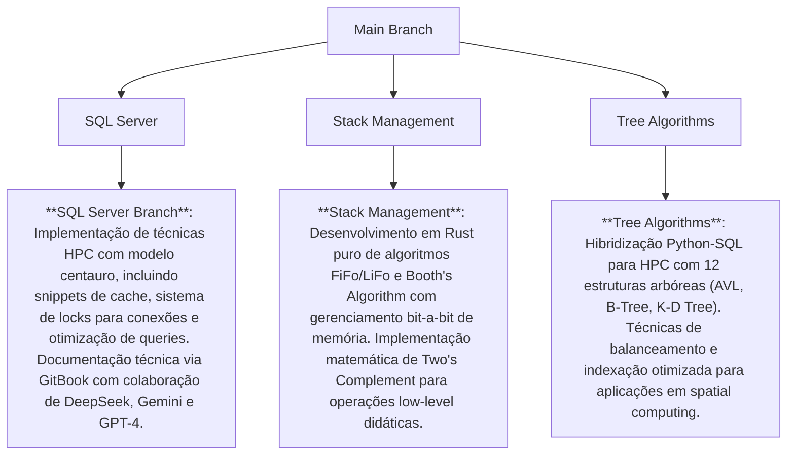

# Qual o Objetivo Desse Repo?

Bom, como não consigo fazer nada pequeno (e ), decidi virar autodidata **no modo hardcore**:

- Saí do meu último curso técnico por estar muito avançado (sério, o professor pediu só pra instalar o Linux numa VM... e eu saí do curso depois de burlar o root da appliance dele via mod no GRUB), acabei decidindo sair do curso e focar em estudar por conta propria sem o sistema educacional me atrasando.

- No caso, escolhi aprender pelo modelo centauro: eu assistia os vídeos da playlist dele com 100% de foco no streaming (sim, fiz isso porque a galera aqui tava sem grana pra internet, então hackeei o Wi-Fi da vizinha, montei um [otimizado Bayesiano](https://github.com/Pedro-02931/LaplaceDemon/blob/38e18d6578c1467e3616c7630c3610831f1c42f1/Rede/autoconf.sh), e comecei a dissecar os vídeos com umas ideias que surgiram).

- Usei o Wi-Fi público da estação pra baixar os vídeos no meu Galaxy A01 Core — sim, minha existência é pobre, fodida e triste — tudo pra vizinha não notar que tinha um encosto chupando o modem trocando o stream continuo de videos aleatorios no youtube e procrastinação para commits usando artigos baixados, LLMs capadas offline e muito choro.

# O que Aprendi

Me foquei em aprender hardware e baixo nível: entendi C, como o hardware renderiza os processos, como o scheduler opera, CPU e tudo mais. Com base nisso, criei as branches abaixo que explicam o funcionamento — fica à vontade pra fuçar:

---

## Mapa de Branches:



---

## **Destaques por branch:**

### 1. **SQL Server**:

```plaintext
Foco em High Performance Computing com:
- Técnicas de cache e connection pooling
- Otimização matemática de queries
- Sistema de gerenciamento de locks
- Documentação centauro assistida por IA
- Metodologia de desenvolvimento híbrido (AI + humano)
```

---

### 2. **Stack Management**:

```plaintext
Laboratório low-level com:
- Implementação bare-metal de algoritmos clássicos
- Gerenciamento manual de memória em Rust
- Técnicas de aritmética binária
- Filosofia zero-dependencies
- Abordagem computacional minimalista
```

> Filosofia: “Se couber em 1 byte, não use 2.”

---

### 3. **Tree Algorithms**:

```plaintext
Fusão Python-SQL para:
- Implementação matemática de estruturas complexas
- Técnicas de indexação multi-nível
- Algoritmos de balanceamento automático
- Aplicações em databases e spatial computing
- Paradigma híbrido (SQL pra estrutura + Python pra lógica)
```

---
# Licensa

Deixei sob a **GNU GPLv3** porque é um trampo individual de estudo, e apesar de não acreditar nessa porra de "liberdade de código" (papo de burguês que nunca comeu arroz puro por uma semana), também não curto a ideia de que alguém vai copiar minhas ideias geniais na cara dura.

Então, já que fiz isso 100% solo, **posso mudar a licença quando quiser**. Caso queira usar qualquer fluxograma ou trecho de código daqui, saiba que tecnicamente você tá **injetando um vírus corporativo** em qualquer derivação, e pode ser surpreendido com um fio terra metafórico patrocinado pela Free Software Foundation, Inc.

### Cláusulas extras:

1. **Pode usar? Pode... mas:**

   * Se der merda, o problema é seu.
   * Se ficar rico, me deve 70% em bitcoin.
   * O fantasma da FSF vai te assombrar nos segmentation faults.

2. **Isenção de responsabilidade:**

   * Nenhum Wi-Fi foi hackeado
   * Nenhum professor foi prejudicado 
   * 100% testado em hardware precário (confia)

---

# Últimas Notas

> Se encontrar algum bug, provavelmente é feature.
> Se funcionar, foi sorte.
> Se não funcionar, bem-vindo ao clube.

---
